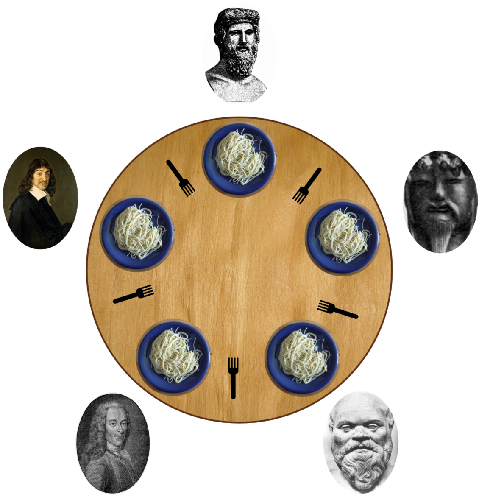

# philosophers42
Basics of threading a process. Creating threads and exploring the use of mutexes.

🏄‍♀️ A thread is a single sequence stream within a process.
Multithreading is a programming technique where a process is divided into multiple smaller units called threads, which can run simultaneously. Multithreading is commonly used in applications like web servers, games, and real-time systems to handle simultaneous tasks like user input, background processing, and other I/O operations simultaneously.

🔐 A Mutex is a lock that we set before using a shared resource and release after using it.
When the lock is set, no other thread can access the locked region of code.

In computer science, the dining philosophers problem is an example problem often used in concurrent algorithm design to illustrate synchronization issues and techniques for resolving them.
Here are the key things you need to know to succeed in this assignment:

🤓 One or more philosophers sit at a round table.
There is a large bowl of spaghetti in the middle of the table.

🤓 The philosophers take turns eating, thinking, and sleeping.
While they are eating, they are not thinking nor sleeping;
while thinking, they are not eating nor sleeping;
and, of course, while sleeping, they are not eating nor thinking.

🍴 There are also forks on the table. There are as many forks as philosophers.

🍝 Since eating spaghetti with just one fork is impractical, a philosopher must pick up
both the fork to their right and the fork to their left before eating.

😴 When a philosopher has finished eating, they put their forks back on the table and
start sleeping. Once awake, they start thinking again. The simulation stops when
a philosopher dies of starvation.
 
🍔 Every philosopher needs to eat and should never starve.

🙊 Philosophers do not communicate with each other.

🤷‍♀️ Philosophers do not know if another philosopher is about to die.

💀 Needless to say, philosophers should avoid dying!
